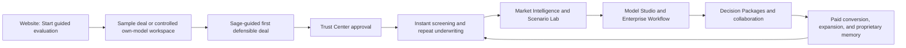
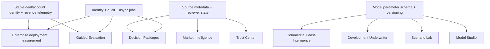

# Cactus Growth and Revenue Product Plan

**Planning date:** 2026-07-27 
**Planning horizon:** 12 months, with conditional bets beyond 12 months 
**Source evidence:** 946 external Sybill meetings, Cactus 1.0 and 2.0 PostHog, the existing 10-project opportunity portfolio, and the 60-ticket planning backlog

## Product-version evidence convention

Every PostHog metric in this plan must be read through one of three explicit lenses:

- **Cactus 1.0 - legacy behavior benchmark:** evidence of jobs users repeatedly performed before the refactor. It validates demand and habitual behavior, but it does not describe the current Cactus 2.0 experience.
- **Cactus 2.0 - current-product evidence:** evidence of the refactored product's activation, workflow adoption, reliability, collaboration, and scalability. It is the primary baseline for current UX and growth decisions.
- **Cross-version - migration evidence:** a comparison used to test whether an important Cactus 1.0 job has been successfully carried into Cactus 2.0. Event taxonomies and route definitions are not assumed to be identical, so these comparisons are directional unless equivalence has been verified.

Both products are intentionally analyzed. Cactus 1.0 identifies proven jobs and usage intensity; Cactus 2.0 shows whether the more scalable redesign makes those jobs easier to discover, complete, trust, and repeat.

| Product | PostHog project | Role in decisions |
|---|---|---|
| Cactus 1.0 | Project 98643 | Legacy demand and behavior benchmark |
| Cactus 2.0 | Project 237852 | Current experience, activation, reliability, and adoption baseline |

The decline of activity in Cactus 1.0 during migration must not be interpreted by itself as declining customer demand or churn. Nor should active-user counts from the two projects be added without cross-project identity resolution.

The refactor should be evaluated against four questions:

1. **Preservation:** did Cactus 2.0 carry forward the high-value jobs proven in Cactus 1.0?
2. **Improvement:** are those jobs easier to discover, complete, verify, and repeat in Cactus 2.0?
3. **Scale:** can more users, organizations, and deals succeed with less manual onboarding and support?
4. **Monetization:** does the improved path increase evaluation-to-paid conversion, retention, expansion, and ACV?

## Executive decision

Cactus should build one connected growth system, not ten independent feature projects:

1. Let a qualified prospect reach a defensible result before paying.
2. Make the result trustworthy enough to adopt.
3. Turn screening and market intelligence into repeat habits.
4. Preserve the customer's Excel model and controls to win larger accounts.
5. Add governance, collaboration, and decision outputs to expand accounts.
6. Enter development and commercial segments only through paid, narrowly scoped bets.

The highest unconstrained business-impact projects are Trust Center, Model Studio, Instant Deal Screen, Market Intelligence, and Guided Evaluation. The first build sequence is different: shared measurement, Guided Evaluation, Trust Center, and Instant Deal Screen must land first because they unlock the funnel through which the larger enterprise and expansion bets produce revenue.

## How the portfolio was prioritized

The Product Manager Skills framework points to a **weighted score with strategic overrides**, rather than pure RICE:

- Cactus is in early product-market-fit/scaling mode.
- There is rich qualitative evidence but uneven behavioral and revenue data.
- Several initiatives are platform or enterprise bets that RICE would underweight.
- Dependencies and time-to-revenue matter as much as raw impact.

The business-growth score uses:

- 35% revenue potential
- 20% adoption and retention impact
- 15% strategic leverage
- 10% user-experience impact
- 10% evidence confidence
- 10% delivery leverage, using effort as a directional proxy

This score is a prioritization input, not an ARR forecast or ROI calculation. Cactus does not yet have billing, CRM stage, product usage, and closed-won/lost data joined well enough to calculate feature ROI.

| Business impact rank | Initiative | Growth score | Effort | Primary revenue pathway | Investment posture |
|---:|---|---:|:---:|---|---|
| 1 | Trust Center 2.0 | 95 | L | Conversion, retention, enterprise win rate | Build now |
| 2 | Model Studio | 89 | XL | Enterprise ACV, pilot conversion, expansion | Validate now; build supported subset next |
| 3 | Instant Deal Screen | 88 | M | New-logo conversion, usage frequency, deal volume | Build now |
| 4 | Market Intelligence and Memory | 87 | XL | Retention, expansion, differentiated paid value | Validate now; build next |
| 5 | Guided Evaluation and Sage Activation | 85 | M | Evaluation-to-paid conversion, lower onboarding cost | Build now; first execution priority |
| 6 | Enterprise Workflow | 83 | L | Larger ACV, multi-user deployment, expansion | Design council now; build next |
| 7 | Scenario Lab | 80 | L | Engagement, seat expansion, retention | Instrument now; build next |
| 8 | Development Underwriter | 77 | XL | New segment ARR | Paid beta later |
| 9 | Commercial Lease Intelligence | 72 | XL | New asset-class ARR | Narrow paid beta after validation |
| 10 | Decision Packages | 71 | M | Workflow completion, collaboration, expansion | Concierge validation; productize later |

## Strategy context

### Product promise

Turn a messy real-estate deal package into a defensible, reusable decision while preserving the customer's model, evidence, and judgment.

### Business outcomes

1. **Acquire more paying customers:** move value demonstration before the payment decision.
2. **Increase activation and retention:** get users to an approved or exported first deal and repeat the workflow.
3. **Increase ARPA and ACV:** support proprietary models, multiple users, controls, integrations, and premium workflows.
4. **Create expansion revenue:** monetize Market Intelligence, Model Studio, enterprise controls, and higher-volume usage.
5. **Reduce cost to serve:** decrease manual onboarding, model setup, support, and rework per activated account.
6. **Expand the addressable market carefully:** enter development and multi-tenant commercial only when paid demand clears explicit gates.

## The growth and revenue loop

## Portfolio programs

### Program A - Self-serve growth engine

**Projects:** Guided Evaluation and Sage Activation, Instant Deal Screen, shared growth telemetry.

**Business job:** Increase qualified evaluation volume, evaluation-to-paid conversion, and repeat deal activity while reducing onboarding labor.

**Revenue metrics:** New ARR, evaluation-to-paid conversion, sales-cycle time, onboarding cost per activated account, CAC payback once acquisition cost is joined.

### Program B - Defensible underwriting core

**Projects:** Trust Center, Model Studio, Scenario Lab, Decision Packages.

**Business job:** Make Cactus trustworthy enough to replace manual rework, fit established firm workflows, and complete a decision inside the product.

**Revenue metrics:** Gross revenue retention, enterprise pilot-to-paid conversion, expansion ARR, product-related loss reasons, support and rework cost.

### Program C - Compounding data and habit

**Projects:** Market Intelligence and Proprietary Memory.

**Business job:** Create a recurring workflow and proprietary-data advantage that improves every future deal.

**Revenue metrics:** Weekly active underwriting teams, accounts reusing approved comps, expansion MRR, retention by module-adoption cohort.

### Program D - Enterprise and segment expansion

**Projects:** Enterprise Workflow, Development Underwriter, Commercial Lease Intelligence.

**Business job:** Increase ACV and expand the addressable market without turning Cactus into a CRM, construction-management product, or ARGUS clone.

**Revenue metrics:** Enterprise ACV, multi-user production deployments, connected workspaces, segment-specific paid beta ARR, gross margin by workflow.

## Build sequence

### Horizon 0 - Prove the plan and repair measurement (0-30 days)

This horizon is mandatory. It prevents the team from shipping a free trial or major enterprise bet without knowing whether it creates revenue.

#### Shared product and revenue telemetry

- Establish stable `account_id`, `organization_id`, `deal_id`, and user identity across product events.
- Join product usage to CRM opportunity, stage, source, segment, closed-won/lost reason, plan, ARR, and expansion.
- Add evaluation, approval, export, share, scenario, and paid-conversion events.
- Separate production, staging, development, internal, and support-impersonation traffic.
- Establish baselines for:
 - evaluation started -> meaningful action -> approved/exported result -> paid;
 - onboarding and support hours per activated account;
 - logo churn, revenue churn, GRR, NRR, ARPA, ACV, and expansion MRR;
 - product COGS per active deal and per activated account.

#### Guided Evaluation discovery and design

- Replace the generic trial question with a qualified **Start guided evaluation** journey.
- Prototype three entry goals: learn Cactus, screen a deal, and test my model.
- Test a sample-deal path and a controlled own-model compatibility path.
- Redesign Sage as a page-aware, deal-aware coach with a persistent checklist outside chat.
- Map navigation, unit mix, income and expense, node terminology, missing inputs, errors, and human escalation.

#### Parallel validation

- Trust Center: test material-exception prioritization with 8-10 analysts.
- Instant Deal Screen: concierge-screen 100 packages for 8-12 design partners.
- Model Studio: spike 20 anonymized workbooks and publish a supported-subset report.
- Market Intelligence: validate evidence cards and private-memory behavior on 30 deals.
- Enterprise: identify which security, permissions, integration, or API blocker is attached to the largest qualified pipeline.

#### Exit gate

Proceed to Horizon 1 only when:

- the evaluation and revenue funnel can be measured end to end;
- at least two Guided Evaluation prototypes have been usability tested;
- Trust and Instant Screen have narrow, validated vertical slices;
- Model Studio has explicit supported and unsupported boundaries.

### Horizon 1 - Build the conversion and trust engine (30-90 days)

#### 1. Guided Evaluation and Sage Activation

Rename the existing **Guided Activation - First Defensible Deal** project to **Guided Evaluation and Sage Activation**.

**Hypothesis:** Letting a qualified prospect complete a sample or controlled own-model evaluation with contextual Sage guidance will increase evaluation-to-paid conversion and reduce onboarding labor because only 27.7% of test-filtered **Cactus 2.0** signups currently reach a meaningful action within 14 days.

**First release:**

- website entry and goal selection;
- disposable evaluation workspace;
- guided multifamily sample deal;
- controlled own-model compatibility check;
- persistent four-step progress path;
- contextual Sage explanations, navigation, validation, and human handoff;
- visible action confirmation and audit trail;
- approved/exported first-result event;
- value summary and paid conversion handoff.

**Proposed decision gate:**

- **Cactus 2.0** signup/evaluation-to-meaningful-action improves from 27.7% to at least 40%;
- approved/exported first-result tracking is reliable;
- onboarding/support hours per activated account decline;
- trust and error guardrails do not worsen.

**Do not ship:** an unlimited anonymous trial, an unbounded model upload promise, or a product tour detached from a real task.

#### 2. Trust Center 2.0

**Hypothesis:** Prioritizing material exceptions and preserving reviewer decisions will improve conversion, retention, and enterprise confidence because users hesitate to delegate consequential underwriting to results they cannot verify.

**First release:**

- T-12 and rent-roll exception queue;
- materiality and confidence ranking;
- source drawer and competing values;
- approve, replace, defer, and escalate;
- downstream model impact;
- reviewer audit trail and tie-out summary.

**Proposed decision gate:**

- material review time declines by at least 30% in beta;
- escaped material-error rate does not increase;
- at least 10 accounts complete the review-to-approved-input workflow.

#### 3. Instant Deal Screen

**Hypothesis:** A zero-setup, explainable package-to-go/no-go workflow will increase new-logo conversion and repeat usage because **Cactus 1.0** Quick Analysis recorded 100,593 pageviews from 215 external identified users, while the comparable named **Cactus 2.0** route recorded only 18 pageviews from 3 users. This is a directional cross-version migration gap, not a like-for-like funnel.

**First release:**

- upload and forwarded-email intake;
- one multifamily buy-box template;
- saved criteria;
- explainable pass, fail, uncertain, and missing-data states;
- promote to full underwriting without re-entry;
- outcome and false-negative review events.

**Proposed decision gate:**

- package-to-decision time falls materially against the concierge baseline;
- users screen multiple deals per active account;
- false-negative and missing-data guardrails are reviewed before automation expands.

### Horizon 2 - Deepen paid value and enterprise fit (3-6 months)

#### 4. Market Intelligence and Memory

**Hypothesis:** Reviewable comp evidence and reusable private memory will increase retention and expansion because Market Intelligence is already the broadest verified **Cactus 2.0** custom workflow: 1,415 submitted messages from 85 external users across 50 organizations.

**First release:**

- rent-comp evidence cards for one asset class;
- source, freshness, relevance, and confidence;
- accept/reject with reason;
- attach comp to a material assumption;
- save and reuse customer-owned comps;
- short source-backed market memo.

**Gate:** demonstrate faster approved comp selection and repeated reuse in design-partner accounts before adding more sources or asset classes.

#### 5. Model Studio

**Hypothesis:** A supported, formula-aware Excel roundtrip will increase enterprise pilot-to-paid conversion and ACV because firms will not abandon proprietary models or accept hard-coded exports.

**First release:**

- one workbook and one asset-class template;
- named-range and cell mapping;
- supported-formula preservation;
- unsupported construct detection;
- test run with real deal values;
- versioned template registry;
- tie-out and change report.

**Gate:** at least 80% of selected pilot workbooks tie out within an agreed tolerance, with no silent unsupported failures. Expand coverage only from observed paid demand.

#### 6. Enterprise Workflow foundation

**Hypothesis:** Reusable governance and integration capabilities will increase ACV and production deployment because enterprise champions cannot expand Cactus without security, permissions, API, and external-system fit.

**First release:**

- project roles and least-privilege defaults;
- audit explorer;
- SSO configuration diagnostics;
- one connector selected from qualified pipeline;
- asynchronous API jobs, status, and webhooks;
- multi-user activation and deployment measurement.

**Gate:** enterprise design partners move from champion-only use to measurable multi-user production deployment.

#### 7. Scenario Lab

**Hypothesis:** Bounded natural-language scenarios with visible diffs will increase engagement and account expansion because customers already use Sage for what-if questions but current scenario behavior is not directly measured.

**First release:**

- five common assumption changes;
- proposed change and model-impact preview;
- material-change confirmation;
- immutable approved base case;
- two-scenario comparison;
- save, restore, share, and scenario lineage.

**Gate:** at least 70% of the validated common scenario requests complete without analyst support, while invalid or silently misapplied changes remain below the agreed quality threshold.

### Horizon 3 - Complete the workflow and run paid segment bets (6-12 months)

#### 8. Decision Packages

**Hypothesis:** Turning approved deal state into source-linked decision material will increase collaboration, retention, and expansion because teams currently rebuild conclusions manually.

**First step:** concierge-generate packages for 20 completed deals before committing a product team.

**First product slice after validation:**

- one IC template;
- executive summary and five red-flag types;
- source-linked conclusions;
- editable preview;
- live read-only link and PDF export;
- stale-package warning.

**Gate:** reduce approved-underwriting-to-shared-package time by at least 50% in the validated audience while keeping unsupported claims at zero.

#### 9. Development Underwriter paid beta

**Hypothesis:** A narrowly scoped development model will create new segment ARR because developers need cost, draw, stabilization, and role-specific inputs that acquisition models cannot represent.

**First release:**

- one multifamily ground-up archetype;
- hard and soft cost stack;
- percentage-based fees;
- straight-line draw;
- simple lease-up and stabilization;
- role-scoped cost entry;
- formula-aware export and tie-out.

**Gate:** 5-8 paid or contractually committed design partners complete and approve models without rebuilding them offline.

**Boundary:** underwriting, decision, and handoff - not invoice, vendor, change-order, or construction project management.

### Horizon 4 - Conditional commercial expansion (12+ months or earlier only with paid pull)

#### 10. Commercial Lease Intelligence

**Hypothesis:** Amendment-aware lease abstraction and a reviewable rollover schedule can create new office, retail, or industrial ARR without requiring full ARGUS parity.

**First release:**

- one asset class and lease type;
- base lease and amendment chain;
- critical-term abstraction;
- rent-roll discrepancy review;
- basic rollover and recovery schedule;
- supported Excel or ARGUS handoff.

**Gate:** choose the segment from qualified pipeline, benchmark at least 500 leases against human abstraction, define the accuracy threshold before development, and require paid beta commitment.

## Shared platform dependencies

## Recommended team topology

This plan assumes two cross-functional product pods plus a shared platform/data lane:

### Pod 1 - Growth and workflow

- Guided Evaluation and Sage Activation
- Instant Deal Screen
- later: Market Intelligence and Decision Packages

### Pod 2 - Trust and enterprise fit

- Trust Center
- Model Studio spike and MVP
- later: Enterprise Workflow and Scenario Lab

### Shared lane

- product and revenue telemetry;
- deal/account identity;
- source/reviewer state;
- model parameter schema and versioning;
- Sage action contract, audit, async jobs, and quality evaluation.

If Cactus has only one delivery pod, preserve the same order and reduce concurrency:

1. measurement and Guided Evaluation slice;
2. Trust Center slice;
3. Instant Deal Screen;
4. Market Intelligence;
5. Model Studio;
6. Enterprise Workflow;
7. Scenario Lab;
8. Decision Packages;
9. Development beta;
10. Commercial beta.

## Portfolio measurement system

### Acquisition and activation

- qualified website visitors starting an evaluation;
- **Cactus 2.0** evaluation workspace created;
- **Cactus 2.0** meaningful underwriting action within 14 days;
- approved/exported first result;
- evaluation-to-paid conversion;
- sales-cycle time and loss reason;
- onboarding/support hours per activated account.

### Retention and expansion

- **Cactus 2.0** week-1 and week-4 retained accounts by cohort;
- cross-version migration rate for proven **Cactus 1.0** jobs, beginning with Quick Analysis;
- logo churn and revenue churn;
- gross revenue retention and net revenue retention;
- expansion MRR by adopted module;
- active deals and returning underwriting teams per account;
- ARPA, ACV, seats, and active users per account.

### Trust and quality

- time from extraction complete to approved inputs;
- material exceptions resolved;
- escaped material errors;
- false-negative screening rate;
- model tie-out rate;
- unsupported or invalid Sage changes;
- correction and export-rework rate.

### Economics and guardrails

- product COGS per active deal;
- AI/extraction cost per approved deal;
- contribution margin by plan and workflow;
- support and model-onboarding cost;
- gross margin effect of data licenses, connectors, and model-processing workloads.

## Quarterly operating cadence

1. Review revenue and retention by cohort and module.
2. Review each initiative's leading product metric and revenue outcome.
3. Re-score initiatives with Product, Design, Engineering, Sales, Customer Success, and Finance.
4. Continue, narrow, pause, or stop initiatives based on their decision gate.
5. Publish what moved, what was learned, what was stopped, and why.

Scores must not become automatic commitments. A high score without a validated problem, supported technical path, or measurable revenue connection is a discovery project - not a full build.

## What not to build now

- An unlimited anonymous free trial.
- A generic Sage chatbot without page context, model controls, confirmation, or audit.
- Arbitrary Excel or VBA support.
- A replacement CRM or transaction-management product.
- Construction project management, invoice approval, or vendor management.
- Full ARGUS parity or simultaneous support for every commercial asset class.
- New modules whose usage cannot be joined to paid conversion, retention, or expansion.

## Linear execution

The existing file `cactus_linear_projects_and_tickets_2026-07-27.csv` already contains six tickets for each of the ten product projects. Before importing or creating projects in Linear:

1. Rename `Guided Activation - First Defensible Deal` to `Guided Evaluation and Sage Activation`.
2. Add a shared `Growth and Revenue Telemetry` project.
3. Add Guided Evaluation tickets for website entry, sandbox/workspace creation, own-model compatibility, contextual Sage, human escalation, and paid conversion.
4. Add project properties for revenue pathway, business-impact rank, execution horizon, effort, confidence, and decision gate.
5. Keep projects in discovery until their entry gate is satisfied; do not move all 60 tickets into active delivery.

## Required executive inputs before financial ROI claims

To turn this plan into a contribution-margin and ROI model, Cactus still needs:

- current MRR and ARR;
- ARPA and ACV by segment and plan;
- new, expansion, churned, and contraction MRR;
- logo churn, revenue churn, GRR, and NRR;
- gross margin and product COGS;
- sales pipeline and closed-won/lost data tied to product blockers;
- onboarding, custom-model, and support labor cost;
- qualified pipeline attached to enterprise, development, and commercial requests.

Until those inputs are joined, project revenue effects should be labeled **hypotheses**, not forecasts.

---

**Public redacted edition.** This document contains aggregate product research. Direct customer identities, verbatim quotes, private recordings, account-level data, and authenticated analytics links are intentionally excluded.
